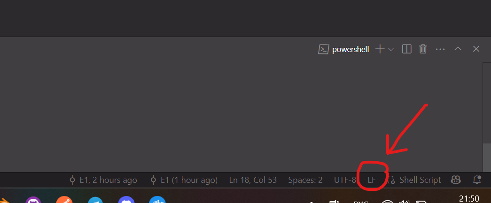

# QITC - это шуточная платформа курсов по программированию


Само название расшифровывается как квалифицированные IT курсы. Фронтенд данного проекта представляет собой скорее SPA, так как по факту реализована только одна страничка. Бэкенд проекта уже более разнообразен и описан ниже.

# Стэк технологий

- Python 3.12 (Backend) - все зависимости описаны в файле requrements.txt
- Next.js (Frontend)

# Как запустить проект

1. Клонируйте данный репозиторий в любое удобное вам место командой:

```
git clone https://github.com/ivanboitsov/QITC.git
```

2. Добавьте в папку проекта файл .env с описаннымим ниже переменными или просто взять их из примера ниже:

```env
POSTGRES_DB=qitc_db
POSTGRES_USER=postgres
POSTGRES_PASSWORD=1234

DB_HOST=db
DB_PORT=5432
DB_NAME=qitc_db
DB_USER=postgres
DB_PASS=1234

MIN_PASSWORD_LENGTH=8

ACCESS_TOKEN_EXPIRE_MINUTES=30
REFRESH_TOKEN_EXPIRE_MINUTES=60*24*7
ALGORITHM=HS256

SESSION_SECRET_KEY=3e4f5g6h7i8j9k0l1m2n3o4p5q6r7s8t9u0v6q2x3y7a

JWT_SECRET_KEY=abc123def456ghi789jkl012mno345pqr678stu901vwx234t
JWT_REFRESH_SECRET_KEY=zyx987wvu654tsr321qpo098nml765kji432hgf109edc

# Нужно вписать свои данные
VK_CLIENT_ID=VK_CLIENT_ID
VK_CLIENT_SECRET=VK_CLIENT_SECRET

YANDEX_CLIENT_ID=YANDEX_CLIENT_ID 
YANDEX_CLIENT_SECRET=YANDEX_CLIENT_SECRET
```

3. Запустите Dokcer Desktop.

#### ВАЖНО! Если вы открываете проект в VS code, проверьте, что файл `resotre.sh`, который лежит по пути `backend\backups\restore.sh`  имеет формат строки `LF`, а не `CRLF`. Это важно, так как Docker может не видеть данного файла.


4. Запустите docker контейнеры данной командой:

```
docker-compose up --build
```

5. Всё готово! Можете протестировать перейдя по данным ссылкам:
    * Сваггер бэка `http://localhost:8000/docs`
    * Страница сайта`http://localhost:3000/`

# Визуальный вид проекта

Много писать не буду, просто смотрите сами ->


# А что в бэкенде?

Прежде чем говорит о внутренней состовляющей необоходимо упомянуть архитектуру бд. Она выглядит следующим образом:


В основе лежит три основных таблицы: пользователя, группы и задач. Связи между пользователем и курсом, а также между пользователем и задачами равны многие ко многим, поэтому имеют проммежуточные таблицы группы и журнала (оценок) соответственно. Далее немного подробнее про объяснение использования данных связей.

Курс имеет три статуса: открытый, закрытый и удалённый. С моей точки зрения, система не должна зацикливаться на определённых курсах, которые хочет запустить в данный момент, а должна иметь вариативность. То есть, если определённый курс плохо зашёл студентам, то его нужно или доработать или заменить на другой. А если курс понравился студентам и принёс пользу - то его можно просто зарегестрировать заново под новым ID, предварительно закрыв предыдущий. Для этого и сущетсвуют данные статусы. На сайте всегда будут отображаться только активные курсы. Теперь про связь между пользователем и курсом. Я думаю логично, что у одного студента может быть несколько курсов, также и логично, что у курса может быть много студентов => логичной проммежуточной таблицой между ними будет являться таблица группы. Она позволяет просмотреть список студентов определённого курса, а также проследить, чтобы количество набранных на курс студентов не превышало значения students_count таблицы курса. Курс также имеет связь один ко одному с таблицей задач. Здесь я думаю объяснять не стоит. Один курс имеет много задач. Таблица задач, соответсвенно имеет внешний ключ по id курса.

Таблица пользователя также имеет поле статуса: пользователь, студент или админ. Я думаю останавливаться здесь особо смысла нет, но стоит упомянуть, что зачисляет на курс и даёт пользователю статус стедента только администриатор.

Между пользователем и задачей также связь многие ко многим. Я считаю это логичным, так как у одного пользователя может быть много задач, и одна задача может быть у нескольких пользователей. Соответственно для этого и сущестует таблица журнала. В ней помимо id задачи и id студента ставится оценка преподавателем и при желании указывается комментарий к решению.

Также стоит упомянуть таблицу заявки. Она имеет связь с таблицей курса, так как подовать заявку можно только на активные и существующие курсы. Как видно из фронта, заявка подаётся для того, чтобы с вами связался администратор, и вы задали интересующеи вопросы или изъявили желание записаться на курс.

## Перейдем к API

Сразу напищу, что подробно останавливаться на каждом роутере, схеме или ошибке, которую он может выдать - я не буду, так как всё это вы можете увидеть в сваггере по ссылке `http://localhost:8000/docs` после запуска проекта, или в папке `routers` которая лежит в папке бэка. Там всё описано и приведны возможные исходы каждого роутера.

Я раcпологал роутеры в алфавитноv порядке (мне так просто проще).

### Application


Простые и рабочие api для создания заявки, доступные любому пользователю (работает на фронт части сайта). А также просмотра конкретной заявки или всех заявок, доступных только пользователю с правами администратора.

### Auth


`API` авторизации через `Yandex` и через `VK`, однако сразу следует сказать, что VK требует `redirec_url` только при наличии `https` протокола и доменного имени, поэтому он не работает. С яндексом всё проще и всё работает, если будете тестировать, то необходимо будет только зарегестрировать своё прилоежение в `Яндекс ID` и вставить `client_id` и `client_secret` в .env файл.

>Также следует заметить, что эти `API` по хорошему должны быть описаны в `user_router`, однако я их вынес отдельно для того, чтобы поработать и потестить, не копаясь в `user_router`.

### Backup


Создание и восстановление бэкапа бд одним запросом. Удобная вещь, которая позоволила мне более детально поработать с PostgreSQL поглубже.

### Course


Стандартные `CRUD` `API` для курса. Единственное о чем бы я сказал, что получение всех активных курсов происходит на готовом фронте и отображается в виде кассет, доступных каждому пользователю. А также просмотр всех задач определённого курса доступны каждому пользователю. Все остальные `API` доступны только администратору.

### Group


`API` группы нужны для добавления или отчисления студента на курс или с курса соответсвенно. Помимо этого админ также может посмотреть список всех студентов всех курсов или же посмотреть список всех студентов определённого курса.

### Task


Стандартные `CRUD` для задач.

### User


Ну и `API` для пользователя. Позволяют зарегестрироваться, авторизироваться, просмотреть или изменить свои данные, а также выйти из аккаунта. Пароль хэшируется медотом `SHA256`, в токене пользователя передаётся его ID и его статус. Сам токен типа `bearer`. Создаётся и формируется в `auth_service` на стадии авторизации пользователя. В общем стандартные методы для пользователя. Для админа здесь нужнны `API` изменения статуса пользователя и просмотра всех пользователей. 


# То, что нужно доработать в проекте

1. В бэке нужно сделать таблицу журнала, а также всю логику связанную с этой таблицей.
2. Нужно корректней обрабатывать ошибки `put` роутеров, в которых ничего не изменлось.
3. Сделать проект на `https://` протоколе и было бы классно сделать доменное имя `qitc.com`.
4. При выполнении 3-его шага доделать авторизацию через `vk`.
5. Дописать все оставшиеся страницы фронта.